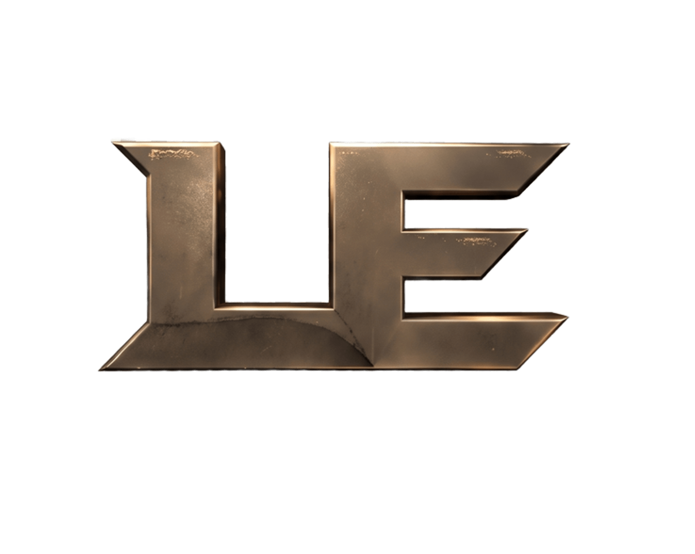

# 🏙️ Last Era RP

<p align="center">
  
</p>

<h1 align="center">Last Era RP</h1>

<p align="center">
  <strong>🌟 A Modern Arabic Roleplay Community</strong>
</p>

<p align="center">
  A modern Arabic roleplay experience built around realism, immersion,
  community, and a new generation of roleplay.
</p>

<p align="center">
  🌐 Website • 💬 Discord • 🛒 <a href="https://last-era.tebex.io/">Store</a>
</p>

---

## 🎮 About

**Last Era RP** is an Arabic roleplay community focused on creating an immersive and organized experience for players and content creators.

The project combines a modern visual identity with community systems, live integrations, applications, support, and a dedicated player experience.

---

## ✨ Features

- 🎨 Modern dark & gold interface
- 📱 Fully responsive design
- 🎬 Cinematic video backgrounds
- 🎥 Content creator & Kick integration
- 🔴 Live / Offline streamer status
- 👥 Discord community statistics
- 📜 Rules & applications system
- 🛠️ Technical support
- 🛒 Tebex store integration
- 🔐 User profiles & authentication

---

## 🛠️ Tech Stack

**Languages & Technologies**

`HTML` • `CSS` • `JavaScript` • `Discord.js` • `Kick API` • `Tebex`

---

## 🎨 Design

The interface is designed around a premium and immersive visual style:

`Dark UI` • `Gold Accents` • `Glassmorphism` • `Glow Effects` • `Smooth Animations` • `Responsive Design`

---

## 📂 Project Structure

```text
Last-Era/
├── index.html
├── LE.png
└── README.md
```

## </> Developers

**Developed by [Raed Mosaed](https://github.com/raedmosaed0) & [Ahmed Tarek](https://github.com/midotarek14)**

---

© 2026 Last Era RP. All rights reserved.
