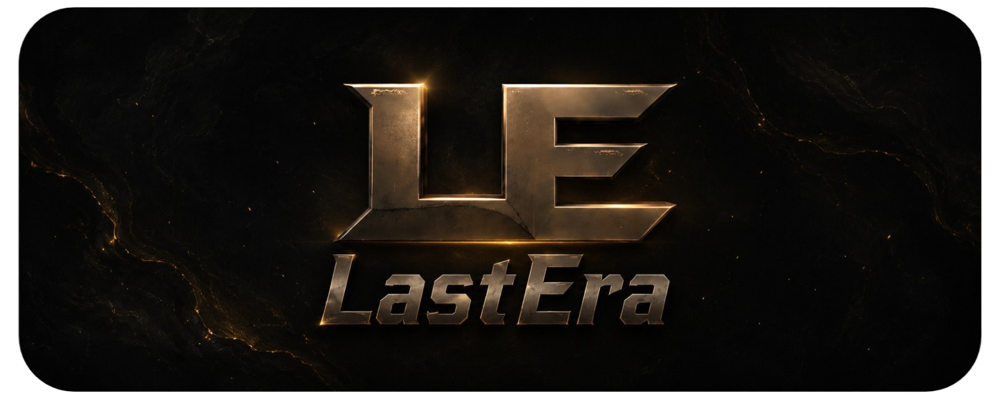
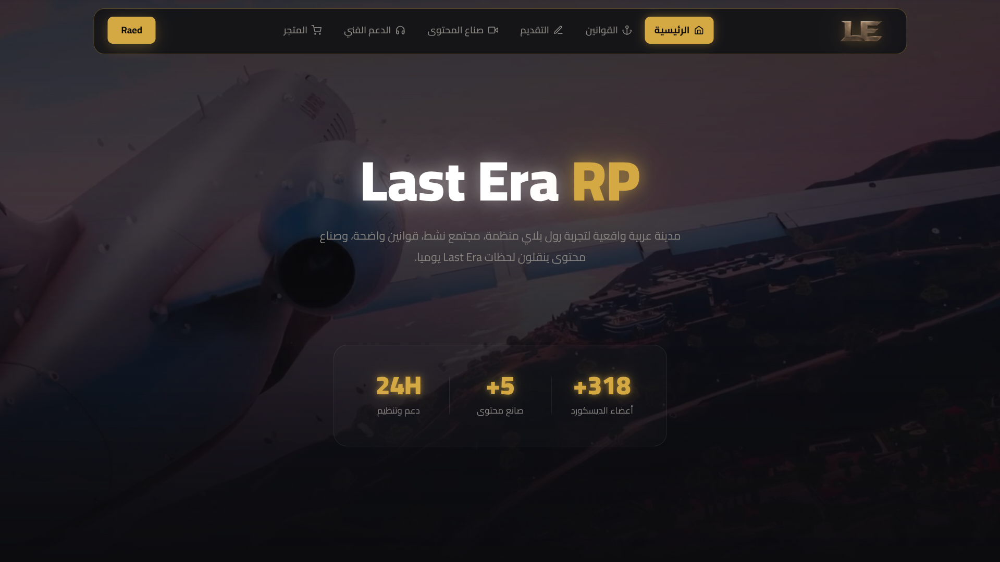
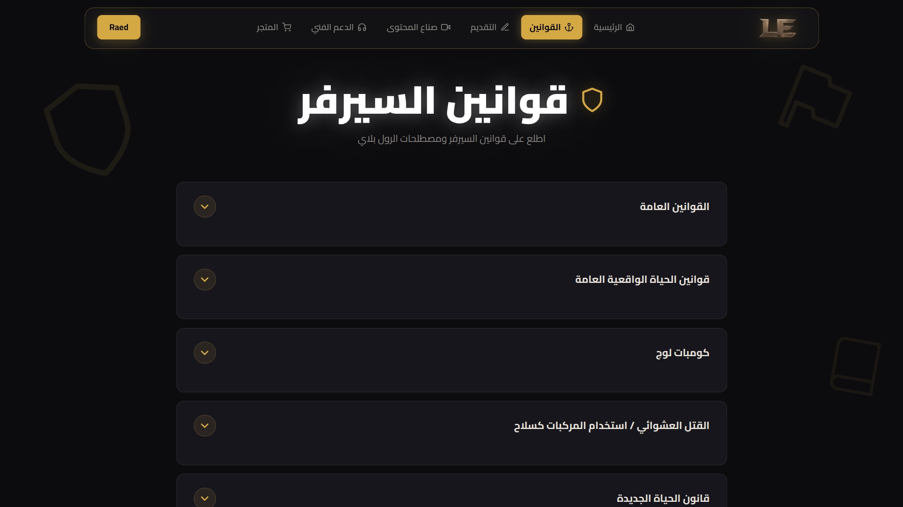
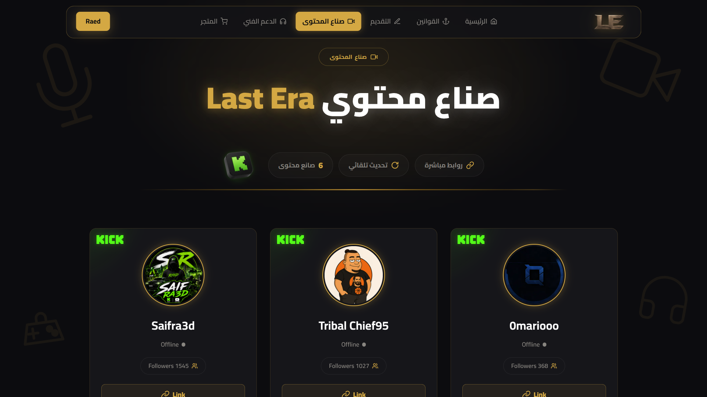

<p align="center">
  
</p>

<h1 align="center">
  <strong>LAST ERA RP — OFFICIAL WEBSITE</strong>
</h1>

## 🎮 About

**Last Era RP** is a modern Arabic roleplay world built around realism, immersive storytelling, and a connected community.

Experience a living city where players create their own stories, creators shape memorable moments, and every detail is designed to deliver a more organized and engaging roleplay experience.

## ✨ Features

- Modern dark & gold interface
- Fully responsive design
- Cinematic video backgrounds
- Content creator & Kick integration
- Live / Offline streamer status
- Discord community statistics
- Rules & applications system
- Technical support
- User profiles & authentication


## 🛠️ Tech Stack

`HTML5`  
`CSS3`  
`JavaScript`  
`Kick API`  
`Discord.js`

## 🎨 Design

`Dark UI`  
`Gold Accents`  
`Cinematic Visuals`  
`Glassmorphism`  
`Glow Effects`  
`Smooth Animations`  
`Responsive Design`


## 📸 Website Preview

<p align="center">
  
</p>

<p align="center">
  
</p>

<p align="center">
  
</p>


## 📂 Project Structure

```text
Last-Era/
├── Banner.webp
├── banner2.webp
├── LE.png
├── logo.webp
├── index.html
├── style.css
├── script.js
├── README.md
├── homepage.png
├── rules.png
└── creators.png
```

## 🌐 Live Website

<p align="left">
  <a href="https://last-era.vercel.app/">
    
  </a>
</p>


## </> Developers

**Developed by [Raed Mosaed](https://github.com/raedmosaed0) & [Ahmed Tarek](https://github.com/midotarek14)**

---

<p align="left">
   © 2026 Last Era RP. All rights reserved.
</p>
